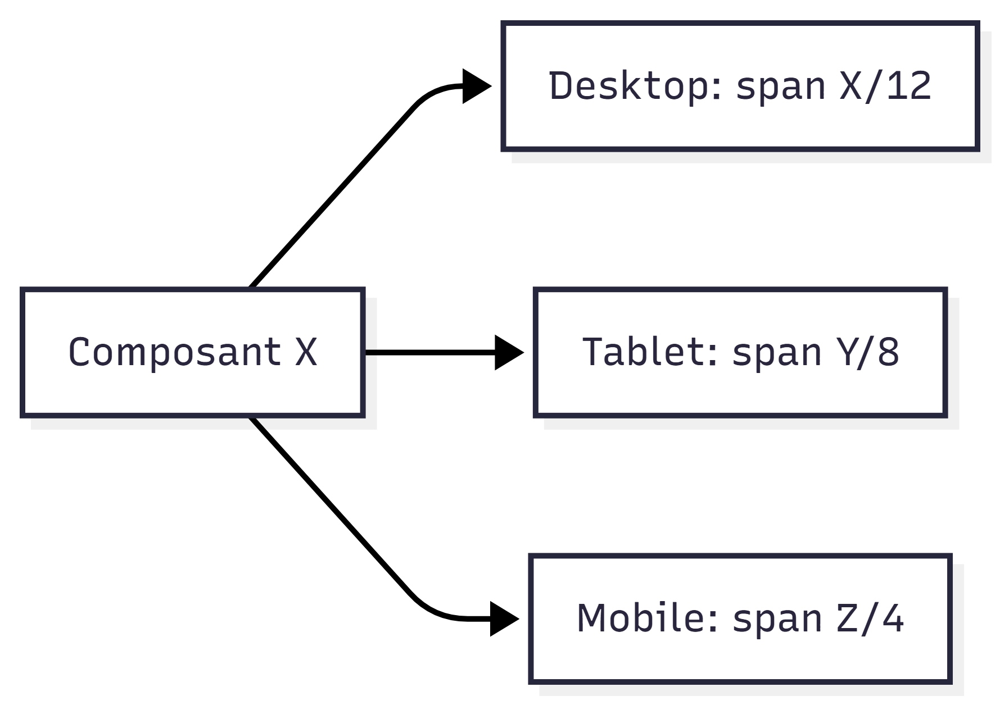
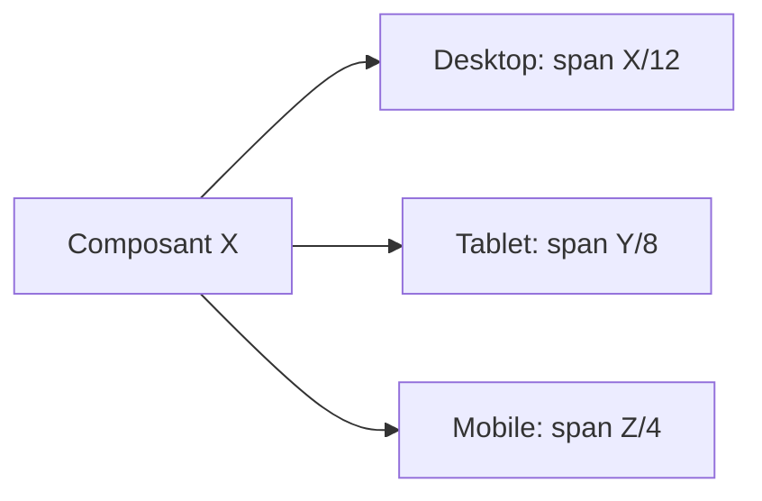

# Confluence - Cartographie composants frontend

## But
Centraliser les regles de maquettage manuel, la cartographie composants, et un workflow de revue visuelle via Storybook.

## Perimetre
- Source: template frontend React/Vite
- Granularite: 1 page par composant + 1 page master

## Regles ecran et grille
| Device | Colonnes | Goutiere | Marges externes | Largeur cible |
|---|---:|---:|---:|---|
| Desktop | 12 | 24 px | 120 px | >= 1280 px |
| Tablet | 8 | 20 px | 48 px | 768-1279 px |
| Mobile | 4 | 16 px | 16 px | <= 767 px |

## Regle de definition des composants
Pour chaque composant, la maquette doit indiquer explicitement:
1. Le span en colonnes pour Desktop/Tablet/Mobile.
2. Les variantes a utiliser (ou a creer).
3. Les etats (default, hover, focus, disabled, loading).
4. Les exceptions et cas limites.

## Workflow recommande
1. Partir de `carto/templates/component-template.md`.
2. Marquer `A COMPLETER` si la variante n existe pas.
3. Valider Design + Dev avant statut `Ready`.

## Storybook - Visualisation et manipulation des variables
### Installation et lancement
Depuis `frontend`:
```bash
npm install
npm run storybook
```
Storybook est servi sur `http://localhost:6006`.

### Build de verification (compile statique)
Depuis `frontend`:
```bash
npm run build-storybook
```
Le build statique est genere dans `frontend/storybook-static`.

### Emplacement des stories UI
- `src/stories/ui/Button.stories.tsx`
- `src/stories/ui/Input.stories.tsx`
- `src/stories/ui/Select.stories.tsx`
- `src/stories/ui/Pagination.stories.tsx`
- `src/stories/ui/Tabs.stories.tsx`
- `src/stories/ui/Table.stories.tsx`
- `src/stories/ui/Drawer.stories.tsx`
- `src/stories/ui/DatePicker.stories.tsx`

### Manipulation des variables composant
Dans Storybook, utiliser l onglet `Controls` pour modifier:
- props de style (`variant`, `size`, `disabled`, `loading`)
- props fonctionnelles (`isMulti`, `pageSize`, `currentPage`, `placement`)
- scenario par etat (stories `Playground`, `Disabled`, `WithIcon`, etc.)

### Regle d ajout d une nouvelle story
1. Creer `src/stories/ui/<Component>.stories.tsx`.
2. Definir une story `Playground` avec `args` controlables.
3. Ajouter 1 a 3 scenarios metier (erreur, loading, mobile, etc.).
4. Reporter les choix valides dans `carto/components/ui/<Component>.md`.

## Composants prioritaires P1
| Composant | Fiche | Statut |
|---|---|---|
| Button | `carto/components/ui/Button.md` | P1-ready |
| Input | `carto/components/ui/Input.md` | P1-ready |
| Select | `carto/components/ui/Select.md` | P1-ready |
| Table | `carto/components/ui/Table.md` | P1-ready |
| Dialog | `carto/components/ui/Dialog.md` | P1-ready |
| Card | `carto/components/ui/Card.md` | P1-ready |
| Pagination | `carto/components/ui/Pagination.md` | P1-ready |
| Tabs | `carto/components/ui/Tabs.md` | P1-ready |
| Drawer | `carto/components/ui/Drawer.md` | P1-ready |
| DatePicker | `carto/components/ui/DatePicker.md` | P1-ready |
| RangeCalendar | `carto/components/ui/RangeCalendar.md` | P1-ready |
| TimeInput | `carto/components/ui/TimeInput.md` | P1-ready |
| Notification | `carto/components/ui/Notification.md` | P1-ready |
| Tooltip | `carto/components/ui/Tooltip.md` | P1-ready |

## Liens index complet
- Index global: `carto/COMPONENT_INDEX.md`
- README cartographie: `carto/README.md`
- Template de fiche: `carto/templates/component-template.md`

## Bloc visuel de reference
```text
Desktop 12 cols: [1][2][3][4][5][6][7][8][9][10][11][12]
Tablet   8 cols: [1][2][3][4][5][6][7][8]
Mobile   4 cols: [1][2][3][4]
```




## Tableau de suivi design
| Composant | Variantes completees | Etats completes | Responsive complete | Statut |
|---|---|---|---|---|
| Button | Oui | Oui | Partiel | P1-ready |
| Input | Oui | Oui | Partiel | P1-ready |
| Select | Oui | Oui | Partiel | P1-ready |
| Table | Oui | Oui | Partiel | P1-ready |
| Dialog | Oui | Oui | Partiel | P1-ready |
| Card | Oui | Oui | Partiel | P1-ready |

## Definition of done
- Variantes et etats verifies avec exemples.
- Spans de colonnes renseignes pour 3 breakpoints.
- Cas manquants identifies en `A COMPLETER`.
- Validation croisee Design + Dev.
- Storybook `Playground` disponible avec controls sur props critiques.

## Inventaire complet composants
- Catalogue auto complet: `carto/COMPONENT_CATALOG_ALL.md`
- Definition marque/tokens: `carto/BRAND_DEFINITION.md`

## Decision de style ouverte
- Si une option n existe pas dans le template, la declarer dans `BRAND_DEFINITION.md` (section variantes non definies).
- Si validee (Design + Dev), reporter la decision dans la fiche composant correspondante.

## Story supplementaire
- `src/stories/ui/BrandPlayground.stories.tsx`
