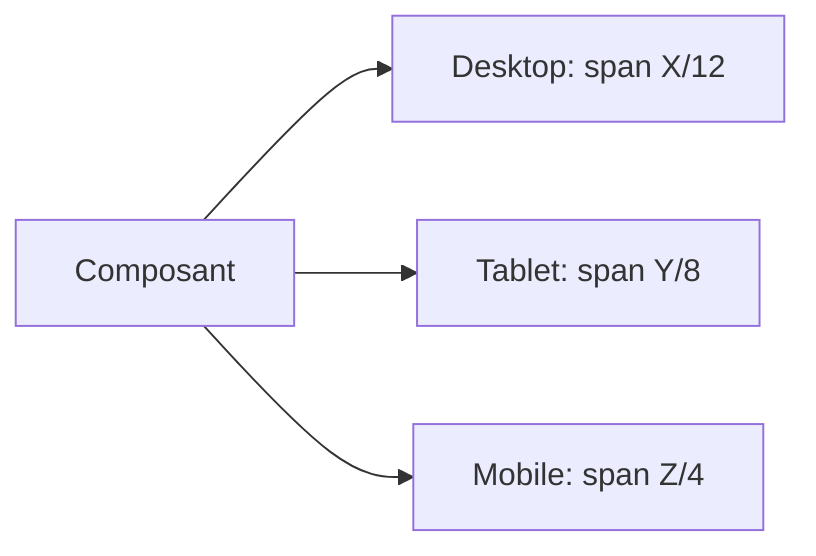

# Cartographie composants frontend

## Objectif
Ce dossier contient la cartographie des composants du template frontend, au format Markdown, pour une reprise en Confluence et pour guider la creation manuelle de maquettes.

## Regle de grille responsive
Ces valeurs sont la base de travail initiale. A valider avec Design.

| Device | Colonnes grille | Goutiere | Marges externes |
|---|---:|---:|---:|
| Desktop | 12 | 24 px | 120 px |
| Tablet | 8 | 20 px | 48 px |
| Mobile | 4 | 16 px | 16 px |

## Colonnes par composant
Chaque fiche composant doit definir combien de colonnes le composant utilise selon le device.

| Composant | Desktop (12) | Tablet (8) | Mobile (4) | Statut |
|---|---:|---:|---:|---|
| Exemple: Button group | 4 | 4 | 4 | A COMPLETER |

## Convention de documentation par composant
Chaque fiche est dans `carto/components/<categorie>/<Composant>.md` et suit ce schema:
1. Role composant
2. Variantes existantes dans le template
3. Variantes necessaires manquantes (A COMPLETER)
4. Etats (default, hover, focus, disabled, loading)
5. Regles de grille (desktop/tablet/mobile)
6. Cas limites et accessibilite
7. Visuel simple (ASCII ou Mermaid)

## Visuel de reference grille
```text
Desktop 12 cols: [1][2][3][4][5][6][7][8][9][10][11][12]
Tablet   8 cols: [1][2][3][4][5][6][7][8]
Mobile   4 cols: [1][2][3][4]
```



## Process conseille
1. Completer `COMPONENT_INDEX.md` en priorisant les composants utilises par les ecrans business.
2. Completer chaque fiche composant avec variantes + spans de colonnes.
3. Marquer explicitement ce qui n existe pas dans le template avec `A COMPLETER`.
4. Ajouter screenshot Figma ou capture app dans la section visuel de la fiche.
