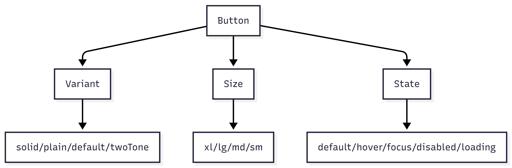
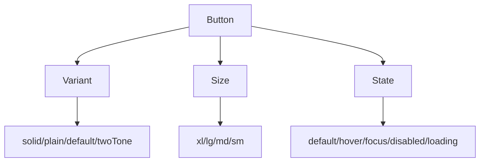

# Button

## Metadata
- Categorie: ui
- Fichier source principal: `src/components/ui/Button/Button.tsx`
- Statut cartographie: Draft
- Owner: A COMPLETER

## Role
Declencher une action utilisateur, prioritaire ou secondaire, avec ou sans icones.

## Variantes existantes dans le template
| Variante | Description | Presente |
|---|---|---|
| solid | Bouton plein, action principale | Oui |
| plain | Bouton fond transparent | Oui |
| default | Style par defaut du theme | Oui |
| twoTone | Fond + contraste fort | Oui |

## Variantes necessaires mais absentes
| Variante a ajouter | Pourquoi | Priorite | Statut |
|---|---|---|---|
| icon-only | Actions dans toolbar dense | High | A COMPLETER |
| destructive | Action irreversible explicite | High | A COMPLETER |
| loading-with-progress | Feedback operation longue | Medium | A COMPLETER |

## Etats interaction
| Etat | Comportement | Token/style | Note |
|---|---|---|---|
| default | Etat normal | bg + text token |  |
| hover | Accentuation contraste | hover token |  |
| focus | Focus visible clavier | ring token | Doit etre visible |
| disabled | Interaction bloquee | opacity/reduced contrast | Sans pointer |
| loading | Spinner + texte optionnel | spinner token | Bloque click |

## Taille
| Taille | Hauteur | Padding X | Font size |
|---|---:|---:|---:|
| xl | A COMPLETER | A COMPLETER | A COMPLETER |
| lg | A COMPLETER | A COMPLETER | A COMPLETER |
| md | A COMPLETER | A COMPLETER | A COMPLETER |
| sm | A COMPLETER | A COMPLETER | A COMPLETER |

## Responsive et grille
| Device | Colonnes dispo | Span composant | Alignement |
|---|---:|---:|---|
| Desktop | 12 | 2 a 4 | left/center selon contexte |
| Tablet | 8 | 2 a 4 | left |
| Mobile | 4 | 4 (full width recommande pour CTA) | stretch |

## Matrice variantes x etats
```text
                default   hover   focus   disabled   loading
action-blue        x        x       x        x         x
action-white       x        x       x        x         x
action-grey        x        x       x        x         x
success            x        x       x        x         x
error              x        x       x        x         x
warning            x        x       x        x         x
```

## Visuel rapide
```text
Desktop (12): [----Button span 3----][content span 9]
Tablet  (8): [---Button span 4---][content span 4]
Mobile  (4): [--Button full width span 4--]
```




## Champs a completer avec Figma
- Valeurs exactes de taille (height, radius, spacing)
- Contrastes et tokens couleurs par variante
- Regles icone gauche/droite
- Regle texte long + ellipsis
- Cas bouton dans toolbar et dans formulaire

## Liens
- Figma: A COMPLETER
- Spec: A COMPLETER
