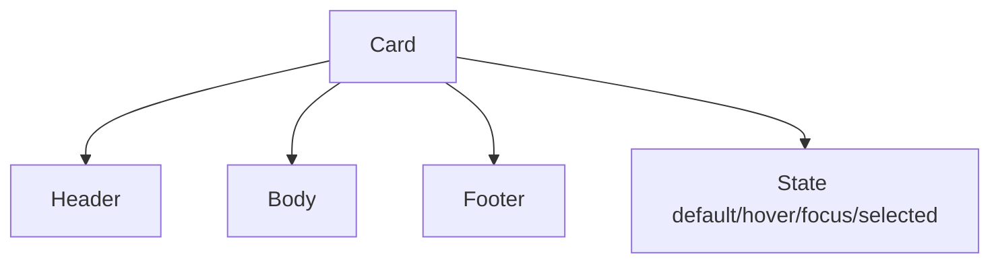

# Card

## Metadata
- Categorie: ui
- Fichier source principal: `src/components/ui/Card/Card.tsx`
- Statut cartographie: Draft
- Owner: A COMPLETER

## Role
Conteneur de contenu compose (titre, metriques, actions, media) reutilisable sur dashboards et listes.

## Variantes existantes dans le template
| Variante | Description | Presente |
|---|---|---|
| basic | Contenu simple | Oui |
| bordered | Delimitation forte | Oui |
| elevated | Ombre pour priorisation | Oui |
| interactive | Hover/clickable | Oui |

## Variantes necessaires mais absentes
| Variante a ajouter | Pourquoi | Priorite | Statut |
|---|---|---|---|
| skeleton-card | Chargement dashboard | High | A COMPLETER |
| selectable-card | Selection multiple | Medium | A COMPLETER |
| status-card | Etat metier tagge | Medium | A COMPLETER |

## Etats interaction
| Etat | Comportement | Token/style | Note |
|---|---|---|---|
| default | Affichage neutre | surface token |  |
| hover | Accentuation elevation | shadow hover | Si clickable |
| focus | Anneau focus | ring token | Access clavier |
| selected | Mise en avant selection | selected token | A COMPLETER |
| disabled | Non actif | muted token | Rare |

## Structure
| Zone | Description |
|---|---|
| Header | Titre + actions |
| Body | Contenu principal |
| Footer | CTA secondaire ou meta |

## Responsive et grille
| Device | Colonnes dispo | Span recommande | Alignement |
|---|---:|---:|---|
| Desktop | 12 | 3, 4, 6 ou 12 selon type | left/grid |
| Tablet | 8 | 4 ou 8 | left/grid |
| Mobile | 4 | 4 | stack |

## Regles de composition
- Uniformiser hauteurs dans une meme rangee si comparatif.
- Limiter contenu texte a 2-3 lignes dans les cartes grillees.
- Garder CTA principal visible sans scroll interne.

## Visuel rapide
```text
+------------------------------+
| Header                (...)  |
|------------------------------|
| Body                         |
|------------------------------|
| Footer [Action]              |
+------------------------------+
```




## Champs a completer avec Figma
- Hauteurs standard par type de card
- Espacements internes
- Regles de troncature titre/sous-titre
- Variation clickable vs non-clickable

## Liens
- Figma: A COMPLETER
- Spec: A COMPLETER
