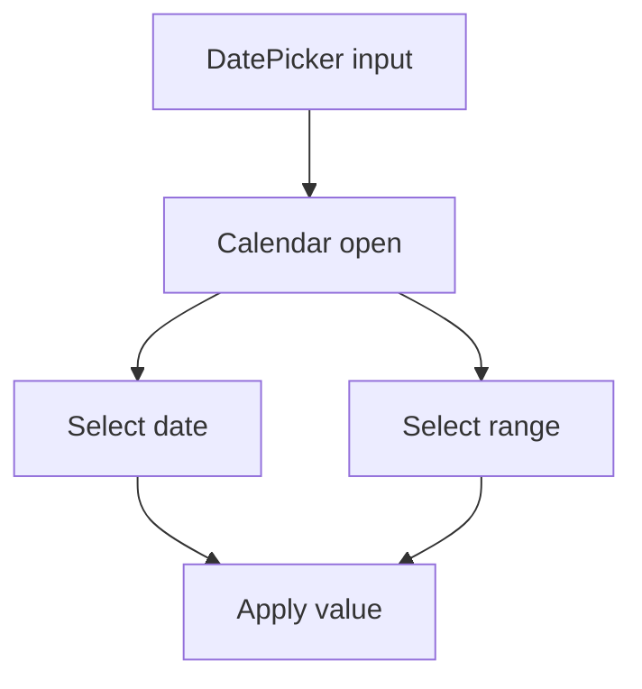

# DatePicker

## Metadata
- Categorie: ui
- Fichier source principal: `src/components/ui/DatePicker/DatePicker.tsx`
- Statut cartographie: Draft
- Owner: A COMPLETER

## Role
Selectionner une date (ou plage) avec controle calendrier et formatage.

## Variantes existantes dans le template
| Variante | Description | Presente |
|---|---|---|
| single-date | Selection date unique | Oui |
| date-range | Selection intervalle | Oui |
| date-time | Date + heure | Oui |
| disabled-date | Jours inactifs selon regle | Oui |

## Variantes necessaires mais absentes
| Variante a ajouter | Pourquoi | Priorite | Statut |
|---|---|---|---|
| presets-range | Raccourcis (7j, 30j, mois) | High | A COMPLETER |
| month-year-picker | Cas reporting mensuel | Medium | A COMPLETER |
| timezone-aware | Produits multi-zones | Medium | A COMPLETER |

## Etats interaction
| Etat | Comportement | Token/style | Note |
|---|---|---|---|
| default | Champ ferme | field token |  |
| open | Popover calendrier visible | calendar token |  |
| hover-day | Jour survole | day hover |  |
| selected | Date/plage selectionnee | selected token |  |
| disabled | Date indisponible | disabled day token |  |
| invalid | Erreur format/contrainte | error token | A COMPLETER |

## Structure
| Zone | Description |
|---|---|
| Input | Valeur formatee |
| Calendar header | Navigation mois/annee |
| Grid | Jours ou mois |
| Footer | Actions reset/apply (optionnel) |

## Responsive et grille
| Device | Colonnes dispo | Span recommande | Alignement |
|---|---:|---:|---|
| Desktop | 12 | 3 a 6 | left |
| Tablet | 8 | 4 a 8 | left |
| Mobile | 4 | 4 | full width |

## Regles d usage
- Afficher le format attendu proche du champ.
- Bloquer les dates hors contrainte metier.
- Pour range, rendre debut/fin explicites.

## Visuel rapide
```text
[Input date     v]
   +----------------------+
   | <  Feb 2026  >       |
   | Mo Tu We Th Fr Sa Su |
   | .. .. .. .. .. .. .. |
   +----------------------+
```




## Champs a completer avec Figma
- Format date par locale
- Tailles des cellules calendrier
- Style plage debut/milieu/fin
- Mode mobile (dialog vs popover)

## Liens
- Figma: A COMPLETER
- Spec: A COMPLETER
