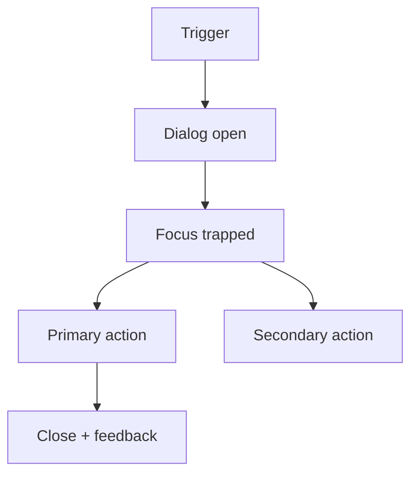

# Dialog

## Metadata
- Categorie: ui
- Fichier source principal: `src/components/ui/Dialog/Dialog.tsx`
- Statut cartographie: Draft
- Owner: A COMPLETER

## Role
Presenter une action ou une information prioritaire en superposition, avec confirmation explicite.

## Variantes existantes dans le template
| Variante | Description | Presente |
|---|---|---|
| centered | Modale centree standard | Oui |
| confirm | Message + CTA primaire/secondaire | Oui |
| with-header-footer | Titre, contenu, actions | Oui |
| closable | Fermeture croix/escape/outside | Oui |

## Variantes necessaires mais absentes
| Variante a ajouter | Pourquoi | Priorite | Statut |
|---|---|---|---|
| destructive-confirm | Suppression irreversible | High | A COMPLETER |
| full-screen-mobile | Lecture et formulaires longs | High | A COMPLETER |
| non-dismissible | Cas critique metier | Medium | A COMPLETER |

## Etats interaction
| Etat | Comportement | Token/style | Note |
|---|---|---|---|
| closed | Non visible | - |  |
| opening | Animation entree | motion token |  |
| open | Focus lock actif | overlay + panel |  |
| loading-action | CTA bloque avec spinner | loading token |  |
| error-inline | Message erreur dans contenu | error token |  |

## Structure
| Zone | Description |
|---|---|
| Overlay | Fond obscurci |
| Header | Titre + close optionnel |
| Body | Texte, formulaire, details |
| Footer | Actions primaire/secondaire |

## Responsive et grille
| Device | Colonnes dispo | Span recommande | Alignement |
|---|---:|---:|---|
| Desktop | 12 | 4 a 8 | center |
| Tablet | 8 | 6 a 8 | center |
| Mobile | 4 | 4 | full screen ou full width |

## Visuel rapide
```text
[overlay]
  +--------------------------+
  | Header            [x]    |
  | Body                     |
  | Footer [Cancel] [OK]     |
  +--------------------------+
```




## Accessibilite
- Role `dialog` ou `alertdialog` selon criticite.
- Focus initial sur titre ou premier controle.
- Retour focus sur trigger a la fermeture.

## Champs a completer avec Figma
- Largeurs modales par breakpoint
- Espacements internes header/body/footer
- Hierarchie visuelle des CTA
- Animation entree/sortie

## Liens
- Figma: A COMPLETER
- Spec: A COMPLETER
