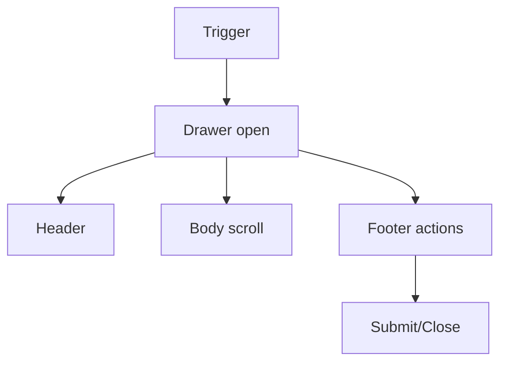

# Drawer

## Metadata
- Categorie: ui
- Fichier source principal: `src/components/ui/Drawer/Drawer.tsx`
- Statut cartographie: Draft
- Owner: A COMPLETER

## Role
Afficher un panneau lateral temporaire pour edition, details, filtres ou actions secondaires.

## Variantes existantes dans le template
| Variante | Description | Presente |
|---|---|---|
| right-drawer | Ouverture depuis la droite | Oui |
| left-drawer | Ouverture depuis la gauche | Oui |
| with-header | Titre et close | Oui |
| with-footer-actions | CTA en pied | Oui |

## Variantes necessaires mais absentes
| Variante a ajouter | Pourquoi | Priorite | Statut |
|---|---|---|---|
| full-height-form | Formulaire long avec sticky footer | High | A COMPLETER |
| narrow-utility | Outils contextuels rapides | Medium | A COMPLETER |
| mobile-fullscreen | UX mobile lisible | High | A COMPLETER |

## Etats interaction
| Etat | Comportement | Token/style | Note |
|---|---|---|---|
| closed | Invisible | - |  |
| opening | Animation entree | motion token |  |
| open | Overlay + panneau actif | panel token |  |
| closing | Animation sortie | motion token |  |
| blocked | Action en cours, controles bloques | loading token | A COMPLETER |

## Structure
| Zone | Description |
|---|---|
| Overlay | Fond masque |
| Header | Titre + close |
| Body | Contenu scrollable |
| Footer | Actions primaire/secondaire |

## Responsive et grille
| Device | Colonnes dispo | Span recommande | Alignement |
|---|---:|---:|---|
| Desktop | 12 | 4 a 6 | right ou left |
| Tablet | 8 | 5 a 8 | right ou left |
| Mobile | 4 | 4 | full screen recommande |

## Visuel rapide
```text
[overlay.........................]
                +---------------+
                | Header    [x] |
                | Body          |
                | Body          |
                | Footer CTA    |
                +---------------+
```




## Accessibilite
- Role `dialog` avec label de titre.
- Focus trap et fermeture clavier `Esc`.
- Retour focus sur trigger.

## Champs a completer avec Figma
- Largeurs exactes par breakpoint
- Regle sticky header/footer
- Overlay opacity
- Animations ouverture/fermeture

## Liens
- Figma: A COMPLETER
- Spec: A COMPLETER
