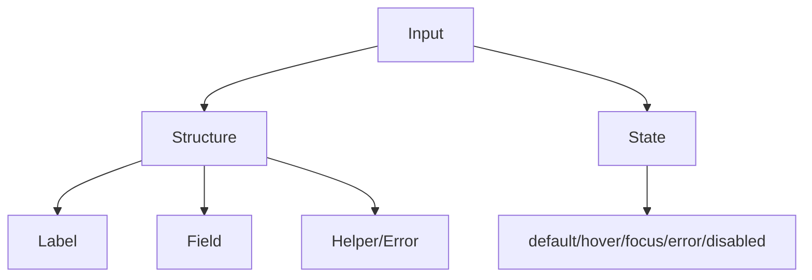

# Input

## Metadata
- Categorie: ui
- Fichier source principal: `src/components/ui/Input/Input.tsx`
- Statut cartographie: Draft
- Owner: A COMPLETER

## Role
Saisir une valeur courte ou moyenne (texte, email, mot de passe via wrapper, recherche).

## Variantes existantes dans le template
| Variante | Description | Presente |
|---|---|---|
| default | Champ standard avec bordure | Oui |
| invalid | Champ en erreur validation | Oui |
| disabled | Champ non editable | Oui |
| with-prefix/suffix | Integre dans InputGroup | Oui |

## Variantes necessaires mais absentes
| Variante a ajouter | Pourquoi | Priorite | Statut |
|---|---|---|---|
| readonly-emphasized | Affichage non editable mais lisible | Medium | A COMPLETER |
| clearable | UX recherche et filtres | High | A COMPLETER |
| loading | Chargement valeur distante | Medium | A COMPLETER |

## Etats interaction
| Etat | Comportement | Token/style | Note |
|---|---|---|---|
| default | Saisie active | border/input bg |  |
| hover | Legere emphase bordure | border hover |  |
| focus | Anneau focus visible | ring token | Clavier obligatoire |
| error | Message + bordure erreur | error token | Avec aide texte |
| disabled | Non interactif | disabled token | Curseur not-allowed |

## Specs de contenu
| Item | Regle |
|---|---|
| Placeholder | Informatif, pas substitut du label |
| Label | Toujours visible pour formulaires metier |
| Texte d aide | Court, sous le champ |
| Erreur | 1 message clair, actionnable |

## Responsive et grille
| Device | Colonnes dispo | Span recommande | Alignement |
|---|---:|---:|---|
| Desktop | 12 | 3 a 6 | left |
| Tablet | 8 | 4 a 8 | left |
| Mobile | 4 | 4 | stretch |

## Matrice variantes x etats
```text
                      default hover focus error disabled
single-line              x      x     x     x      x
with-prefix/suffix       x      x     x     x      x
search-input             x      x     x     x      x
```

## Visuel rapide
```text
Desktop (12): [Label + Input span 4][Aide/erreur]
Tablet  (8): [Label + Input span 6]
Mobile  (4): [Label]
            [Input span 4]
```




## Champs a completer avec Figma
- Hauteurs exactes par taille (sm/md/lg)
- Spacing label/champ/message
- Traitement texte long et icones prefix/suffix
- Regle d alignement dans formulaires en grille

## Liens
- Figma: A COMPLETER
- Spec: A COMPLETER
