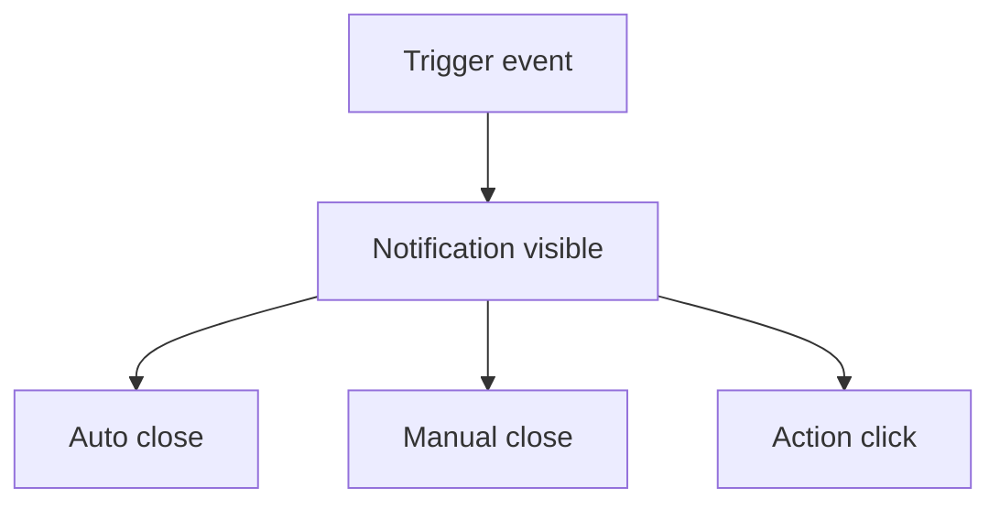

# Notification

## Metadata
- Categorie: ui
- Fichier source principal: `src/components/ui/Notification/Notification.tsx`
- Statut cartographie: Draft
- Owner: A COMPLETER

## Role
Afficher un message contextuel temporaire (success, info, warning, error) avec priorite visuelle.

## Variantes existantes dans le template
| Variante | Description | Presente |
|---|---|---|
| success | Confirmation action reussie | Oui |
| info | Information neutre | Oui |
| warning | Alerte non bloquante | Oui |
| error | Echec ou probleme | Oui |

## Variantes necessaires mais absentes
| Variante a ajouter | Pourquoi | Priorite | Statut |
|---|---|---|---|
| actionable | Inclure bouton action | High | A COMPLETER |
| persistent | Message jusqu a dismissal | Medium | A COMPLETER |
| stacked-grouped | Empilement intelligent | Medium | A COMPLETER |

## Etats interaction
| Etat | Comportement | Token/style | Note |
|---|---|---|---|
| entering | Animation entree | motion token |  |
| visible | Message affiche | surface token |  |
| hover | Pause auto close possible | hover token | A COMPLETER |
| dismissing | Animation sortie | motion token |  |
| dismissed | Retire du viewport | - |  |

## Structure
| Zone | Description |
|---|---|
| Icon | Type de notification |
| Content | Titre + description |
| Actions | CTA optionnel |
| Close | Fermeture manuelle |

## Responsive et grille
| Device | Colonnes dispo | Span recommande | Alignement |
|---|---:|---:|---|
| Desktop | 12 | 3 a 5 | top-right |
| Tablet | 8 | 4 a 6 | top-right |
| Mobile | 4 | 4 | top/full width |

## Visuel rapide
```text
[icon] Success
Data saved successfully.
[Undo]                     [x]
```




## Champs a completer avec Figma
- Duree par severite
- Position exacte et offsets
- Gestion empilement multi notifications
- Hierarchie titre/description/actions

## Liens
- Figma: A COMPLETER
- Spec: A COMPLETER
