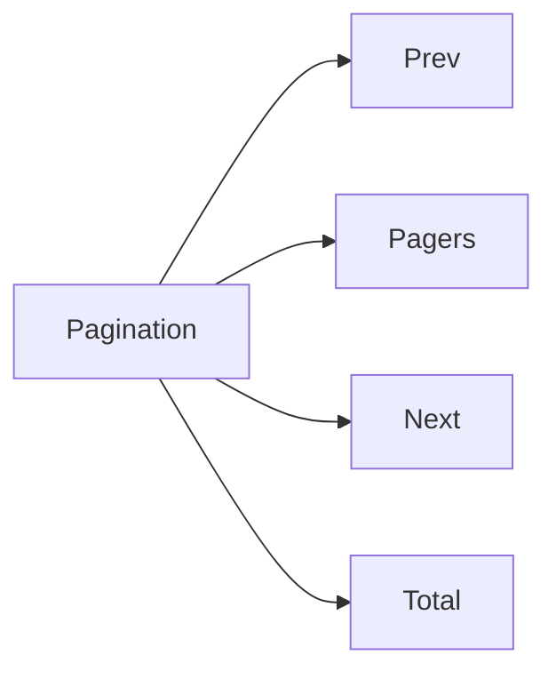

# Pagination

## Metadata
- Categorie: ui
- Fichier source principal: `src/components/ui/Pagination/Pagination.tsx`
- Statut cartographie: Draft
- Owner: A COMPLETER

## Role
Permettre la navigation entre pages de donnees et controler le volume affiche.

## Variantes existantes dans le template
| Variante | Description | Presente |
|---|---|---|
| basic | Prev/Next + pages numeriques | Oui |
| with-total | Affiche total des elements | Oui |
| compact | Densite reduite | Oui |
| disabled-controls | Navigation bloquee selon limites | Oui |

## Variantes necessaires mais absentes
| Variante a ajouter | Pourquoi | Priorite | Statut |
|---|---|---|---|
| page-size-selector | Controler taille de page | High | A COMPLETER |
| jump-to-page | Acces rapide grand volume | Medium | A COMPLETER |
| mobile-minimal | UX mobile simplifiee | High | A COMPLETER |

## Etats interaction
| Etat | Comportement | Token/style | Note |
|---|---|---|---|
| default | Navigation disponible | control token |  |
| hover | Accentuation item | hover token |  |
| active-page | Page courante mise en avant | active token |  |
| disabled | Controle inactif | disabled token | Prev/Next limites |
| loading | Bloque interactions pendant refresh | loading token | A COMPLETER |

## Structure
| Zone | Description |
|---|---|
| Prev | Recul page |
| Pagers | Numeros de pages |
| Next | Avance page |
| Total | Nombre d elements (optionnel) |

## Responsive et grille
| Device | Colonnes dispo | Span recommande | Alignement |
|---|---:|---:|---|
| Desktop | 12 | 4 a 12 | right ou space-between |
| Tablet | 8 | 6 a 8 | center/right |
| Mobile | 4 | 4 | center |

## Visuel rapide
```text
[Prev] [1] [2] [3] [...] [10] [Next]   Total: 240
```




## Champs a completer avec Figma
- Taille des controles et espacement
- Regle d ellipsis selon nombre de pages
- Version mobile minimale
- Position du total et page-size

## Liens
- Figma: A COMPLETER
- Spec: A COMPLETER
