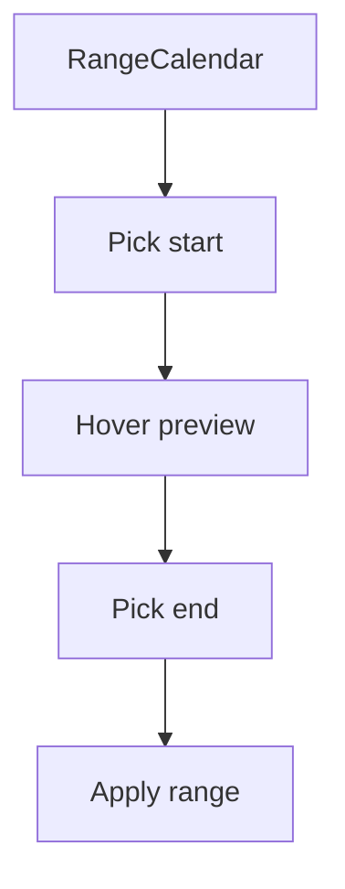

# RangeCalendar

## Metadata
- Categorie: ui
- Fichier source principal: `src/components/ui/DatePicker/RangeCalendar.tsx`
- Statut cartographie: Draft
- Owner: A COMPLETER

## Role
Selectionner une plage de dates avec visualisation continue debut/milieu/fin.

## Variantes existantes dans le template
| Variante | Description | Presente |
|---|---|---|
| standard-range | Plage simple debut-fin | Oui |
| month-navigation | Navigation mois precedent/suivant | Oui |
| disabled-days | Jours indisponibles | Oui |
| inline-calendar | Affichage calendrier integre | Oui |

## Variantes necessaires mais absentes
| Variante a ajouter | Pourquoi | Priorite | Statut |
|---|---|---|---|
| presets-panel | Raccourcis de periode | High | A COMPLETER |
| dual-month-view | Comparaison visuelle rapide | Medium | A COMPLETER |
| week-selection | Cas reporting hebdo | Medium | A COMPLETER |

## Etats interaction
| Etat | Comportement | Token/style | Note |
|---|---|---|---|
| default | Calendrier neutre | calendar token |  |
| hover-range | Previsualisation de plage | hover range token |  |
| selected-start | Debut de plage | start token |  |
| selected-middle | Milieu de plage | middle token |  |
| selected-end | Fin de plage | end token |  |
| disabled | Jour non selectionnable | disabled token |  |

## Responsive et grille
| Device | Colonnes dispo | Span recommande | Alignement |
|---|---:|---:|---|
| Desktop | 12 | 4 a 8 | left/center |
| Tablet | 8 | 6 a 8 | left |
| Mobile | 4 | 4 | full width |

## Visuel rapide
```text
+----------------------+
| < Feb 2026 >         |
| Mo Tu We Th Fr Sa Su |
| 10 [11][12][13] 14   |
|    start  mid  end   |
+----------------------+
```




## Champs a completer avec Figma
- Traitement visuel debut/milieu/fin
- Espacements et taille cellules
- Strategie mobile (1 ou 2 mois)
- Regles de dates min/max

## Liens
- Figma: A COMPLETER
- Spec: A COMPLETER
