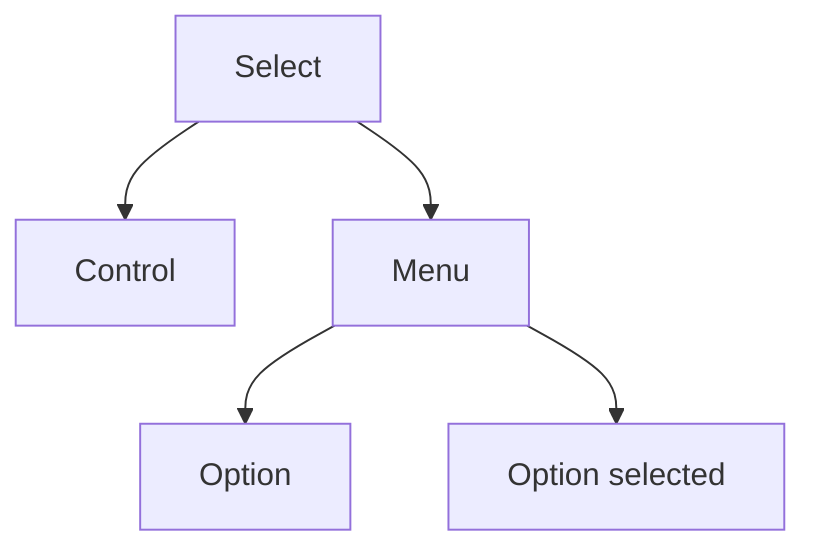

# Select

## Metadata
- Categorie: ui
- Fichier source principal: `src/components/ui/Select/Select.tsx`
- Statut cartographie: Draft
- Owner: A COMPLETER

## Role
Selectionner une ou plusieurs options dans une liste, avec recherche et etiquettes si necessaire.

## Variantes existantes dans le template
| Variante | Description | Presente |
|---|---|---|
| single | Choix unique | Oui |
| multi | Choix multiple | Oui |
| searchable | Filtre local dans la liste | Oui |
| disabled | Non interactif | Oui |

## Variantes necessaires mais absentes
| Variante a ajouter | Pourquoi | Priorite | Statut |
|---|---|---|---|
| async-search | Donnees distantes volumineuses | High | A COMPLETER |
| grouped-options | Hierarchie metier | Medium | A COMPLETER |
| creatable | Ajout rapide d option | Medium | A COMPLETER |

## Etats interaction
| Etat | Comportement | Token/style | Note |
|---|---|---|---|
| default | Valeur ou placeholder | field token |  |
| open | Menu deroule visible | menu token | Z-index a verifier |
| hover | Ligne option survolee | option hover |  |
| focus | Focus clavier composant | ring token | Accessibilite |
| disabled | Non interactif | disabled token |  |

## Structure
| Zone | Contenu |
|---|---|
| Control | Label valeur + chevron |
| Menu | Liste d options |
| Option | Label + etat selected |
| Multi value | Tags selectionnes |

## Responsive et grille
| Device | Colonnes dispo | Span recommande | Alignement |
|---|---:|---:|---|
| Desktop | 12 | 3 a 6 | left |
| Tablet | 8 | 4 a 8 | left |
| Mobile | 4 | 4 | stretch |

## Matrice variantes x etats
```text
                   default open focus disabled
single               x      x    x       x
multi                x      x    x       x
searchable           x      x    x       x
```

## Visuel rapide
```text
[Select control]
  -> [Menu]
     [Option 1]
     [Option 2]
     [Option 3]
```




## Champs a completer avec Figma
- Hauteur control et rayons
- Densite menu (row height)
- Gestion de longues listes et virtualisation
- Regle de chips multi-select

## Liens
- Figma: A COMPLETER
- Spec: A COMPLETER
