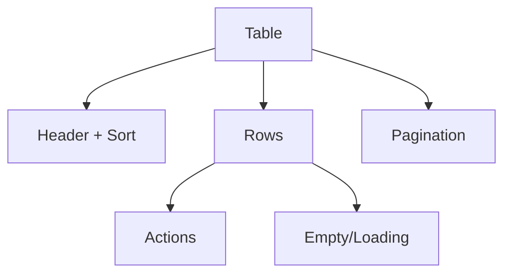

# Table

## Metadata
- Categorie: ui
- Fichier source principal: `src/components/ui/Table/Table.tsx`
- Statut cartographie: Draft
- Owner: A COMPLETER

## Role
Presenter des donnees structurees avec tri, pagination et actions ligne.

## Variantes existantes dans le template
| Variante | Description | Presente |
|---|---|---|
| basic | Colonnes + lignes simples | Oui |
| sortable | Tri par colonne | Oui |
| compact | Densite reduite via classes | Oui |
| with-pagination | Pagination externe | Oui |

## Variantes necessaires mais absentes
| Variante a ajouter | Pourquoi | Priorite | Statut |
|---|---|---|---|
| row-selection | Actions bulk metier | High | A COMPLETER |
| sticky-header | Grandes listes scrollables | High | A COMPLETER |
| expandable-row | Details inline | Medium | A COMPLETER |

## Etats interaction
| Etat | Comportement | Token/style | Note |
|---|---|---|---|
| default | Affichage standard | table token |  |
| hover-row | Ligne survolee | row hover |  |
| sorted | Colonne active | sorter active | Ic directionnelle |
| loading | Skeleton/placeholders | skeleton token |  |
| empty | Etat vide guide | empty state | CTA optionnel |

## Structure
| Zone | Description |
|---|---|
| Header | Noms colonnes + tri |
| Body | Donnees lignes |
| Actions | Boutons par ligne ou menu |
| Footer | Pagination / total |

## Responsive et grille
| Device | Colonnes dispo | Span recommande | Alignement |
|---|---:|---:|---|
| Desktop | 12 | 12 | full width |
| Tablet | 8 | 8 | full width |
| Mobile | 4 | 4 | mode card/stack recommande |

## Regles mobile
- Prioriser 2 a 4 colonnes critiques.
- Convertir les colonnes secondaires en bloc details.
- Conserver les actions principales visibles.

## Visuel rapide
```text
+------------------------------------------------------+
| H1 ^ | H2 | H3 | Actions                             |
+------------------------------------------------------+
| R1C1 | R1C2 | R1C3 | ...                             |
| R2C1 | R2C2 | R2C3 | ...                             |
+------------------------------------------------------+
| Pagination / total                                   |
+------------------------------------------------------+
```




## Champs a completer avec Figma
- Hauteur de ligne par densite
- Style colonne triable active/inactive
- Strategie responsive exacte mobile (table vs cards)
- Position des actions ligne et bulk actions

## Liens
- Figma: A COMPLETER
- Spec: A COMPLETER
