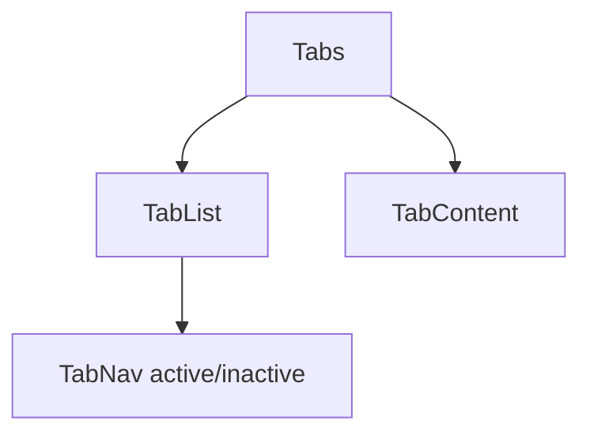

# Tabs

## Metadata
- Categorie: ui
- Fichier source principal: `src/components/ui/Tabs/Tabs.tsx`
- Statut cartographie: Draft
- Owner: A COMPLETER

## Role
Organiser le contenu en sections paralleles et limiter la charge visuelle.

## Variantes existantes dans le template
| Variante | Description | Presente |
|---|---|---|
| line | Onglets avec indicateur ligne | Oui |
| pill | Onglets style boutons | Oui |
| vertical | Navigation verticale | Oui |
| disabled-tab | Onglet indisponible | Oui |

## Variantes necessaires mais absentes
| Variante a ajouter | Pourquoi | Priorite | Statut |
|---|---|---|---|
| icon-tab | Navigation plus compacte | Medium | A COMPLETER |
| scrollable-tabs | Nombreux onglets | High | A COMPLETER |
| badge-tab | Compteurs par section | Medium | A COMPLETER |

## Etats interaction
| Etat | Comportement | Token/style | Note |
|---|---|---|---|
| default | Onglet inactif visible | tab token |  |
| hover | Mise en avant survol | hover token |  |
| active | Onglet selectionne | active token | indicateur visible |
| focus | Focus clavier | ring token | accessibilite |
| disabled | Onglet non selectionnable | disabled token |  |

## Structure
| Zone | Description |
|---|---|
| TabList | Liste des onglets |
| TabNav | Bouton onglet |
| TabContent | Contenu actif |

## Responsive et grille
| Device | Colonnes dispo | Span recommande | Alignement |
|---|---:|---:|---|
| Desktop | 12 | 6 a 12 | left |
| Tablet | 8 | 8 | left |
| Mobile | 4 | 4 | full width/scroll |

## Regles d usage
- Maximum 5 onglets visibles sans scroll sur desktop.
- Sur mobile, preferer onglets scrollables horizontaux.
- Eviter plus d un niveau d onglets imbriques.

## Visuel rapide
```text
[Overview] [Activity] [Settings]
--------------------------------
[Tab content]
```




## Champs a completer avec Figma
- Taille des onglets par densite
- Position et animation indicateur actif
- Regles scroll horizontal mobile
- Cas avec badges/compteurs

## Liens
- Figma: A COMPLETER
- Spec: A COMPLETER
