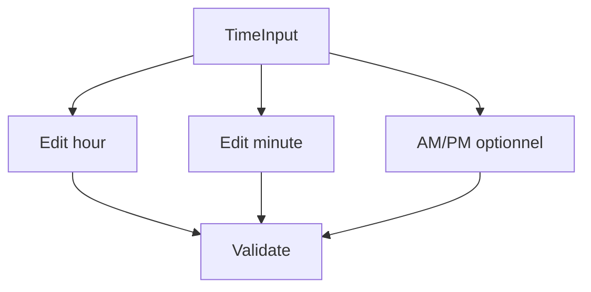

# TimeInput

## Metadata
- Categorie: ui
- Fichier source principal: `src/components/ui/TimeInput/TimeInput.tsx`
- Statut cartographie: Draft
- Owner: A COMPLETER

## Role
Saisir une heure valide (HH:mm) ou un intervalle horaire pour planification.

## Variantes existantes dans le template
| Variante | Description | Presente |
|---|---|---|
| single-time | Heure unique | Oui |
| time-range | Heure debut/fin | Oui |
| am-pm | Format 12h | Oui |
| disabled | Non interactif | Oui |

## Variantes necessaires mais absentes
| Variante a ajouter | Pourquoi | Priorite | Statut |
|---|---|---|---|
| seconds-mode | Besoin precision technique | Medium | A COMPLETER |
| timezone-badge | Contexte multi-pays | Medium | A COMPLETER |
| quick-presets | Horaires frequents | High | A COMPLETER |

## Etats interaction
| Etat | Comportement | Token/style | Note |
|---|---|---|---|
| default | Saisie standard | input token |  |
| focus | Anneau focus | ring token | clavier |
| invalid | Format invalide | error token | message clair |
| disabled | Inactif | disabled token |  |
| readonly | Lisible non editable | readonly token | A COMPLETER |

## Regles metier
- Valider intervalle `start < end` en mode range.
- Normaliser format de sortie (`HH:mm` ou `hh:mm a`).
- Gerer valeurs limites (`00:00`, `23:59`).

## Responsive et grille
| Device | Colonnes dispo | Span recommande | Alignement |
|---|---:|---:|---|
| Desktop | 12 | 2 a 4 | left |
| Tablet | 8 | 3 a 6 | left |
| Mobile | 4 | 4 | stretch |

## Visuel rapide
```text
[ 09 : 30 ] [AM]
[ Start 09:00 ] [ End 17:30 ]
```




## Champs a completer avec Figma
- Masque exact de saisie
- Taille des segments heure/minute
- Style d erreur inline
- Regles d affichage AM/PM

## Liens
- Figma: A COMPLETER
- Spec: A COMPLETER
