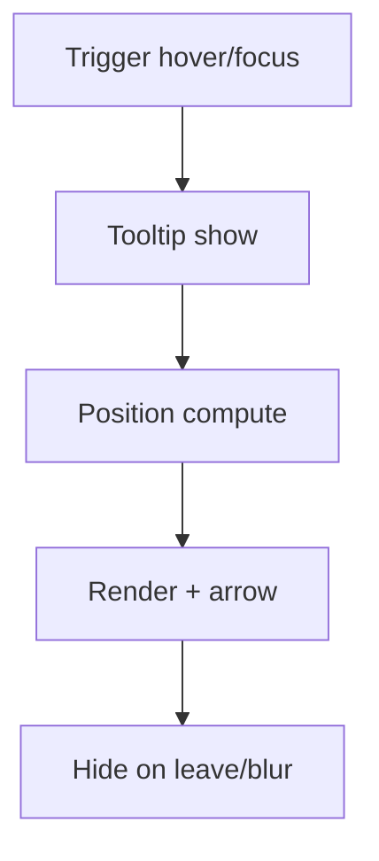

# Tooltip

## Metadata
- Categorie: ui
- Fichier source principal: `src/components/ui/Tooltip/Tooltip.tsx`
- Statut cartographie: Draft
- Owner: A COMPLETER

## Role
Fournir une aide contextuelle courte au survol/focus sans surcharger l interface.

## Variantes existantes dans le template
| Variante | Description | Presente |
|---|---|---|
| top | Affichage au-dessus | Oui |
| bottom | Affichage en dessous | Oui |
| left-right | Affichage lateral | Oui |
| with-arrow | Fleche de positionnement | Oui |

## Variantes necessaires mais absentes
| Variante a ajouter | Pourquoi | Priorite | Statut |
|---|---|---|---|
| rich-tooltip | Contenu enrichi + lien | Medium | A COMPLETER |
| interactive-tooltip | Zone clickable interne | Medium | A COMPLETER |
| mobile-fallback | Remplacement au tap | High | A COMPLETER |

## Etats interaction
| Etat | Comportement | Token/style | Note |
|---|---|---|---|
| hidden | Non visible | - |  |
| showing | Delai puis apparition | motion token |  |
| visible | Message affiche | tooltip token |  |
| repositioning | Ajustement overflow viewport | positioning token |  |
| hidden-on-blur | Masquage sur blur/mouseleave | - |  |

## Regles contenu
- Message court (1 a 2 lignes).
- Ne pas remplacer une aide critique persistante.
- Ajouter `aria-describedby` sur l element cible.

## Responsive et grille
| Device | Colonnes dispo | Span composant | Alignement |
|---|---:|---:|---|
| Desktop | 12 | N/A (overlay) | relatif au trigger |
| Tablet | 8 | N/A (overlay) | relatif au trigger |
| Mobile | 4 | N/A (preferer fallback) | relatif au trigger |

## Visuel rapide
```text
[?]
 \ Tooltip text
```



## Champs a completer avec Figma
- Delai apparition/disparition
- Largeur max et wrapping texte
- Style fl�che et ombre
- Fallback mobile (popover ou helper inline)

## Liens
- Figma: A COMPLETER
- Spec: A COMPLETER
